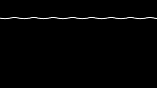

# animspec

Deterministic, declarative animation. An `AnimSpec` (JSON) plus a `SignalFrame`
(audio, data or text reduced to numbers) renders to a frame, and the same spec,
signal and seed always produce the same frame.

[](https://www.npmjs.com/package/animspec)
[](https://github.com/tosin2013/animspec/actions/workflows/verify.yml)
[](LICENSE)

Status: public (v0.1.3 on npm). Licensed under Apache-2.0.

## The promise

| Situation | Guarantee |
| --- | --- |
| Same spec, signal and seed, on two machines of the same processor type | byte-identical frames |
| Same spec, signal and seed, on arm64 and on x64 | every colour channel of every pixel within 8 out of 255 |
| Any other processor type, or Windows | no guarantee; reported as unsupported |

The supported processor types are arm64 and x64. The operating system is not part of the
promise: macOS and Linux agree on the same processor type. Intel Macs and musl-based Linux
are assumed to agree and are not verified.

## Documentation

| Document | What it covers |
| --- | --- |
| [Website](https://tosin2013.github.io/animspec/) | the promise, an animated gallery of every primitive, and the contribution path |
| [User guide](docs/user-guide.md) | install the library, write a spec, render frames, validate model output, choose fonts, troubleshoot |
| [Vocabulary](VOCABULARY.md) | every primitive, its params and its tier; the [gallery](gallery/) shows one thumbnail per primitive, the website animates them all |
| [Software design document](docs/DESIGN_DOC.md) | the architecture, the ADRs, the quality requirements and the gates that prove them |
| [Deployment runbook](docs/deployment.md) | publish a version, refresh the golden reference sets, raise the vocabulary version, roll back |
| [Contributing](CONTRIBUTING.md) | the new-primitive rule, the style rubric, the proposal path; contributions need a signed [CLA](CLA.md) |
| [Releasing](RELEASING.md) | how a version gets published from a git tag |
| [Security](SECURITY.md) | how to report a vulnerability; the community [code of conduct](CODE_OF_CONDUCT.md) |

## What is here

| Path | What it is |
| --- | --- |
| `src/specInterpreter.ts` | Reference interpreter: `drawSpec(ctx, dims, frame, spec, opts)` |
| `src/primitives/registry.ts` | The vocabulary: 29 primitives, their param schemas, `sanitizeLayer`, `buildJsonSchema`, `buildVocabPrompt` |
| `src/primitives/selector.ts` | Deterministic subset / kit selection for LLM prompts |
| `src/specValidator.ts` | `validateAnimSpec` — drops unknown layers, clamps params |
| `src/rng.ts`, `src/types.ts` | Seeded RNG and the `SignalFrame` contract |
| `src/fonts/` | The shipped fonts: the list, the default, and generated font data (do not edit the data modules; `npm run fonts:generate`) |
| `assets/fonts/` | The font files the data is generated from, with their licence texts, sources and checksums |
| `src/primitives/iconData.ts` | Generated: the pixel-icon bitmaps used by `led` and `sprite` (do not edit; `npm run icons:generate`) |
| `scripts/verify-*.ts` | Offline gates |
| `scripts/verify-gates.ts` | The four vetting gates every primitive must pass, with a rule-breaking fixture for each |
| `golden/<type>/hashes.json` | One reference set per processor type (`arm64`, `x64`): a hash for every primitive and composite at three signal levels, each text primitive in each font, plus icon, full-strength flash and maximum-layer cases |
| `golden/<type>/frames/` | The same reference frames as images, used to check the other processor type's tolerance |
| `golden/CHANGES.md` | The log of every intended change to a reference set, with the set and the reason |
| `scripts/golden-update.ts` | Refreshes both reference sets from one machine |
| `golden/vocabulary.json` | The vocabulary record: one entry per version plus the current snapshot |
| `VOCABULARY.md` | Generated: the current version, its history, and each primitive's tier (do not edit; `npm run vocab:record`) |
| `scripts/vocabulary-record.ts` | `npm run vocab:record` — records a new vocabulary version and regenerates `VOCABULARY.md` |
| `scripts/lib/vocabularyRules.ts` | The pure tier, replacement and version rules the registry gate checks |

## Example

```ts
import { createCanvas } from "@napi-rs/canvas";
import { drawSpec, validateAnimSpec } from "animspec";

const { spec } = validateAnimSpec({
  background: "black",
  layers: [{ type: "grid" }, { type: "wave" }],
});

const dims = { width: 1280, height: 720 };
const ctx = createCanvas(dims.width, dims.height).getContext("2d");
drawSpec(ctx, dims, frame, spec!, { reducedFlicker: true, creative: false, seed: 1 });
```

A sample loop, drawn by the committed library from one fixed seed while the signal sweeps
quiet to loud and back (`npm run loops:generate` regenerates it byte for byte):



The [gallery](gallery/) has one thumbnail per primitive; the [website](https://tosin2013.github.io/animspec/) has all of them animating.

## Installing

The package is named `animspec`. Install it with:

```bash
npm install animspec
```

Import from the single entry point:

```ts
import { drawSpec, validateAnimSpec } from "animspec";
```

Node.js 22 or later is required (ESM-only). To work on the library itself, clone this
repository and build locally:

```bash
npm install
npm run build   # compiles src/ to dist/
npm pack        # produces animspec-<version>.tgz
```

To release a new version, bump
the version in `package.json`, push a `v<version>` tag, and the release workflow builds and
publishes it automatically (see [RELEASING.md](RELEASING.md)).

## Fonts

All text is drawn with a font that ships in the library. A font installed on the machine is
never used, so text is the same on a laptop and on a server with no fonts at all.

| Key | Font | Licence | Default |
| --- | --- | --- | --- |
| `dejavu` | DejaVu Sans Mono | Bitstream Vera | yes |
| `jetbrains` | JetBrains Mono | SIL OFL 1.1 | |
| `plex` | IBM Plex Mono | SIL OFL 1.1 | |

A spec chooses one with the optional `font` field, for example `{ "font": "jetbrains", "layers": [...] }`.
One font applies to the whole spec. With no `font`, or a name the library does not ship, the
default is used; `validateAnimSpec` reports an unrecognised name. A character a font lacks
draws as that font's own empty box, the same on every machine. The list is exported as `FONTS`.

## Vocabulary version and tiers

Every spec records the vocabulary version it was written against. `validateAnimSpec` writes
`vocabulary` (the current `VOCABULARY_VERSION`) into every spec it returns; the interpreter
ignores it, so it never changes what is drawn. The current version is exported from the
library and listed, with its history, in `VOCABULARY.md`.

Every primitive has a tier, which decides whether a model is offered it:

| Tier | Offered to a model |
| --- | --- |
| `core` | with no kit, with any kit, and as extras |
| `extended` | only through a kit that lists it |
| `contrib` | only when the caller names it |
| `legacy` | never |

Tiers limit what a model is **offered**, not what a spec may **contain**: `validateAnimSpec`
and `drawSpec` accept a primitive of any tier. Anything shown to a model must be built from a
selection — `buildVocabPrompt(selection)` and `buildJsonSchema(selection)` — never from their
no-argument full-registry forms. Note that `select(kit, breadth, seed)` now returns a different
selection than before this feature for the same inputs, because extended primitives leave the
no-kit selection and the extras.

To raise the version when the vocabulary changes: edit the registry, bump
`VOCABULARY_VERSION` by one, run `npm run vocab:record -- "<one-line summary>"`, and commit the
registry, `golden/vocabulary.json` and `VOCABULARY.md` together.

## Verify

```bash
npm install
npm run verify         # everything below, offline
npm run vocab:record -- "<summary>"  # only when the vocabulary changes and the version is raised
npm run golden:update  # only when a rendering change is intended or a reference case is added; needs Docker
npm run icons:generate # only when the icon set changes
npm run fonts:generate # only when a font file changes
```

`npm run verify` runs `tsc` and then, in order:

| Gate | What it checks |
| --- | --- |
| registry | every primitive is well-formed, unique, tiered, renders, and appears in the prompt and schema; tiers and the version are checked against their rules and the vocabulary record |
| validator | unknown layers are dropped, params are clamped, malformed specs are rejected |
| determinism | no ambient randomness, time, file or network access in `src/`; text uses only shipped fonts; two renders agree; hashes match the reference set for this machine's processor type; every pixel is within 8 of 255 of the other type's frames |
| purity | no file or network access while drawing; icon output does not depend on the working directory |
| palette | every pixel is a mix of background, foreground and accent |
| reactivity | at a fixed moment, output changes with signal level or with the text the signal carries |
| budget | at 1920×1080, at most 3,000 drawing operations and 50 ms per primitive |

The last four are the vetting gates (`npm run verify:gates`). They apply to every primitive
automatically, and the run ends with a count such as `29/29 primitives pass every gate`.

The determinism gate picks the reference set for the machine it runs on. On a processor type
with no reference set, or on Windows, it says the exact comparison was not made and does not
report a pass.

`npm run golden:update` refreshes both reference sets from one machine. It renders this
machine's set directly and the other processor type's set in a container, so it needs Docker
(and the network on the first run). It checks the two new sets against each other and only
then replaces `golden/arm64` and `golden/x64` together; if anything fails, it changes nothing.
It prints which cases changed in which set. Afterwards, add a row to `golden/CHANGES.md` naming
the primitive, the cases, the set (`arm64`, `x64` or `both`) and the reason. A reference
change without a row is rejected in review.

`npm install` points git at `.githooks/`, so `npm run verify` also runs before every push.
CI (`.github/workflows/verify.yml`) runs the same suite on every push to `main` and on every
pull request, together with a secret scan and the CLA check.

## Rules for primitives

- A frame is a pure function of `(spec, SignalFrame, seed)`. No `Math.random`,
  `Date`, network or file access in `draw` — use `mulberry32` from `src/rng.ts`.
- Draw only with the palette (`bg`, `fg`, `accent`). Monochrome by default.
- Build font strings from the size and the draw context's `font`. Never name a font family.
- CPU canvas only (`@napi-rs/canvas`); GPU rasterizers are not byte-reproducible.

## Known limitations

- arm64 and x64 round soft edges slightly differently, so frames are byte-identical only
  between machines of the same processor type. Across the two types they are within the
  tolerance in "The promise".
- Intel Macs and musl-based Linux have not been verified against the reference sets.
- The gate scripts expect to be run from the repo root.
- `src/types.ts` still carries a few types from the app it was extracted from.

## Contributing

See [CONTRIBUTING.md](CONTRIBUTING.md) for the new-primitive rule and the style rubric, and the
[gallery](gallery/) to see what every primitive draws. To report a vulnerability, see
[SECURITY.md](SECURITY.md); for community norms, see [CODE_OF_CONDUCT.md](CODE_OF_CONDUCT.md).
Outside contributions require a signed [CLA](CLA.md).

## License

Apache-2.0 — see `LICENSE` and `NOTICE`. Outside contributions will require a signed
Contributor License Agreement (CLA); the agreement and sign-up bot are not set up yet.

## Third-party

`@napi-rs/canvas` (MIT) is the only runtime dependency. Icon bitmaps derived from
`pixelarticons` (MIT) ship inside the library, as do three fonts: DejaVu Sans Mono
(Bitstream Vera licence), JetBrains Mono and IBM Plex Mono (both SIL OFL 1.1).
`@resvg/resvg-js` (MPL-2.0) is used only at build time, by the icon generator. See `NOTICE`.
