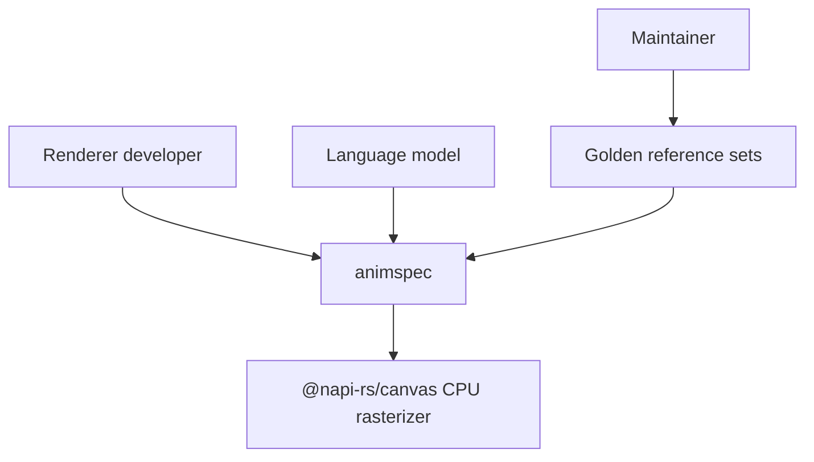
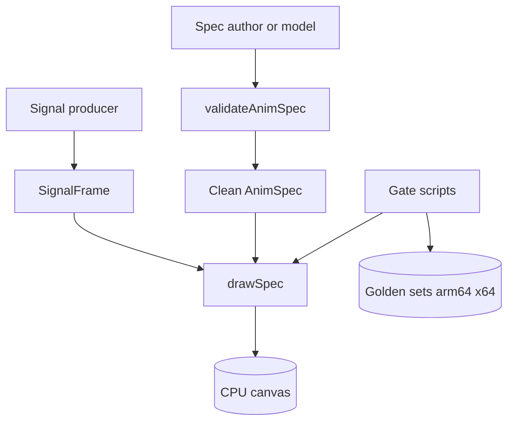
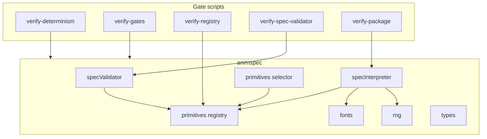
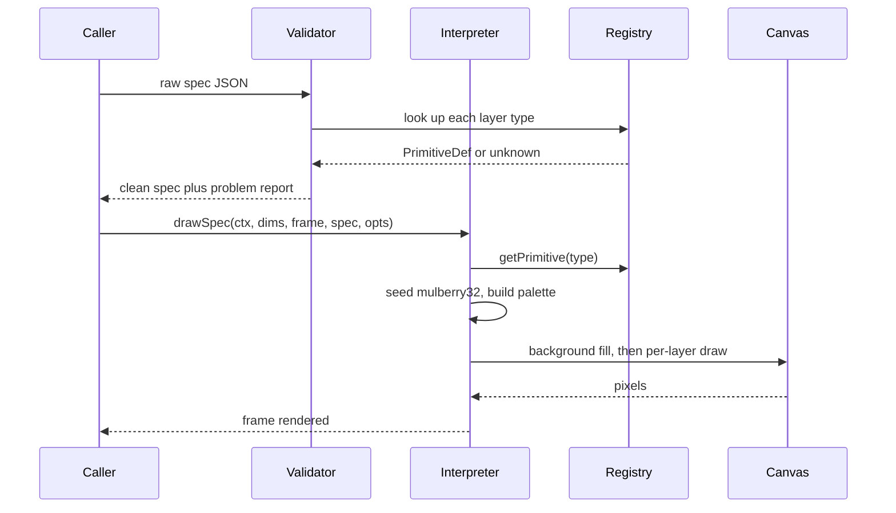
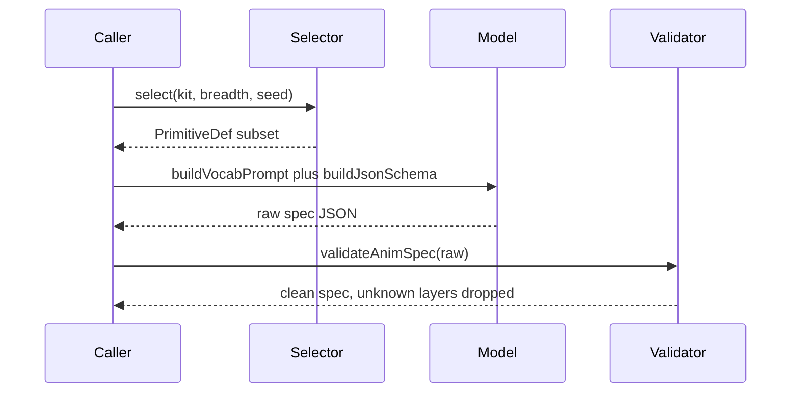
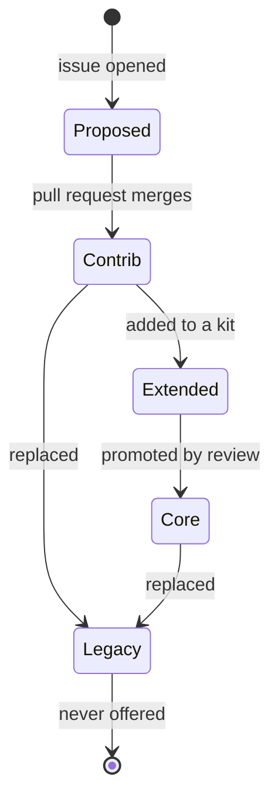
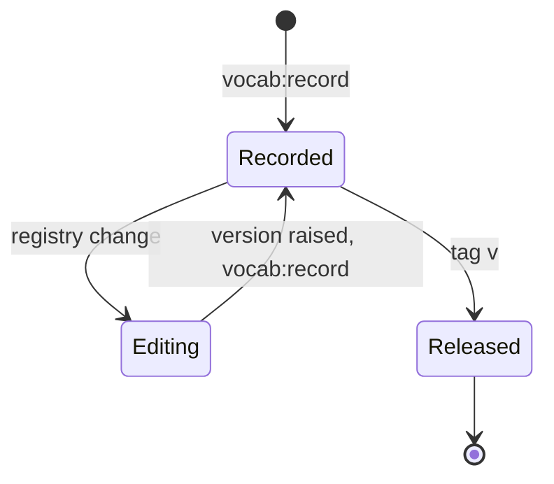
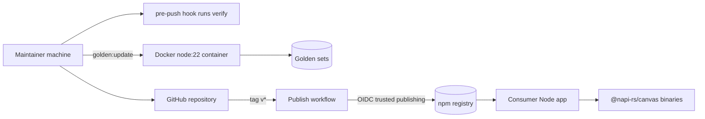

# animspec Software Design Document

**System:** `animspec`
**Version:** `0.1.3`
**Status:** `Accepted`
**Audience:** `Architects, implementers, reviewers`
**Voice:** `STE100`
**Related requirements:** `README.md (The promise), CONTRIBUTING.md (the new-primitive rule)`

---

## 1. Introduction and goals

animspec is a TypeScript library that renders deterministic, declarative animation frames. A caller passes an `AnimSpec` (JSON), a `SignalFrame` (audio, data or text reduced to numbers), and a seed. The library draws one frame onto a CPU canvas. The same spec, signal and seed always produce the same frame on the same processor type.

The system exists because reactive visuals are normally built with ambient randomness, system fonts and GPU rasterizers. Each of those breaks reproducibility. animspec removes them from the visual path. The result is a vocabulary that both humans and language models can write against, and that two machines can verify against each other.

Primary users are developers who embed the library in a Node.js renderer, and language models that generate specs from a selected vocabulary subset.

### 1.1 Quality goals

| ID | Goal | Scenario |
|----|------|----------|
| QG-1 | Determinism | The same spec, signal and seed render byte-identical frames on two machines of the same processor type |
| QG-2 | Cross-type tolerance | Every colour channel of every pixel stays within 8 of 255 between arm64 and x64 renders |
| QG-3 | Purity | A frame draw reads no file, network or clock, and touches no ambient randomness |
| QG-4 | Budget | At 1920x1080, each primitive costs at most 3,000 drawing operations and 50 ms |
| QG-5 | Palette discipline | Every drawn pixel is a mix of background, foreground and accent |
| QG-6 | Reactivity | At a fixed moment, output changes with the signal level or with the text the signal carries |

### 1.2 Stakeholders

| Stakeholder | Expectation |
|-------------|-------------|
| Renderer developer | One entry point, one render call per frame, no hidden state |
| Language model operator | A prompt vocabulary and a JSON schema that constrain model output to drawable layers |
| Primitive contributor | One registry entry plus gates that prove the rules, with a documented proposal path |
| Maintainer | A release that is reproducible from a git tag, with reference sets that catch rendering drift |



---

## 2. Constraints

- Business: the vocabulary grows by community contribution. Outside contributions require a signed CLA (`CLA.md`). A new primitive must draw something no existing primitive can draw by changing its params.
- Technical: TypeScript, ESM-only, Node.js 22 or later. The only runtime dependency is `@napi-rs/canvas` (MIT), a CPU rasterizer. GPU rasterizers are rejected because they are not byte-reproducible. The draw path forbids `Math.random`, `Date`, file and network access. All fonts ship inside the library.
- Legal: Apache-2.0 for the code. Shipped fonts carry Bitstream Vera (DejaVu Sans Mono) and SIL OFL 1.1 (JetBrains Mono, IBM Plex Mono) licences. Icon bitmaps derive from `pixelarticons` (MIT). `@resvg/resvg-js` (MPL-2.0) is a build-time-only dependency. `NOTICE` records the full list.

---

## 3. Context and scope

The system boundary is the library package. Everything that turns a signal into `SignalFrame` numbers lives outside. Everything that encodes frames into video lives outside.

**In scope:** the reference interpreter, the primitive registry and its rules, the validator, the vocabulary selector, the shipped fonts and icon data, and the offline verification gates.

**Out of scope:** audio capture and analysis, video encoding, hosting or serving, GPU rendering, Windows as a verified platform.

Capability identifiers used throughout this document:

| ID | Capability |
|----|------------|
| CAP-1 | Render one frame from a spec, a signal and a seed |
| CAP-2 | Validate and repair raw spec JSON, including model output |
| CAP-3 | Select a vocabulary subset and describe it to a model |
| CAP-4 | Draw text with shipped fonts only |
| CAP-5 | Prove the rules offline with gates and reference sets |



---

## 4. Solution strategy

The code comments cite ADR numbers from a decision log held outside this repository, with the private product the library was split from. This document uses those numbers where the code cites them, and carries no number where it does not.

- ADR 0012: a frame is a pure function of `(spec, SignalFrame, seed)`. All randomness comes from `mulberry32` (cited in `src/types.ts` and `src/rng.ts`).
- ADR 0015: route model output through `validateAnimSpec` before rendering (cited in `src/specValidator.ts` and `src/specInterpreter.ts`).
- ADR 0018: the registry in `src/primitives/registry.ts` is the single source of truth, and the selector offers models a tier-aware subset. The prompt, the JSON schema and the vocabulary record are generated from it (cited in `src/primitives/registry.ts`, `src/primitives/selector.ts` and `src/primitives/customIcons.ts`).
- ADR 0020: the palette quantizer maps the greys primitives draw to palette tones (cited in `src/primitives/registry.ts` and `src/primitives/sprites.ts`).
- ADR 0021: built-in character sprites and the pixel-retro scene (cited in `src/primitives/sprites.ts` and `src/primitives/selector.ts`).
- Local decision: render with a CPU canvas only. `@napi-rs/canvas` keeps rasterization reproducible across machines.
- Local decision: ship all fonts inside the library. A machine with no fonts installed renders text identically to a laptop.
- Local decision: keep one golden reference set per processor type, refreshed together or not at all, with a public change log.

---

## 5. Building block view

| Building block | Responsibility | Requirements |
|----------------|----------------|--------------|
| `src/specInterpreter.ts` | `drawSpec`: fills the background, builds the palette, dispatches layers to primitives | CAP-1, QG-1, QG-5 |
| `src/specValidator.ts` | `validateAnimSpec` and the full-vocabulary JSON schema: drop unknown layers, clamp params, report problems | CAP-2 |
| `src/primitives/registry.ts` | `PRIMITIVES` array, `getPrimitive`, `sanitizeLayer`, `buildVocabPrompt`, `buildJsonSchema`, `VOCABULARY_VERSION`, tiers | CAP-3, CAP-5 |
| `src/primitives/selector.ts` | `select`, `selectDetailed`, kits: deterministic tier-aware subset selection | CAP-3 |
| `src/primitives/sprites.ts`, `icons.ts`, `iconData.ts` | Sprite characters and generated icon bitmaps for `sprite`, `led` and related layers | CAP-1 |
| `src/fonts/` | `FONTS`, `DEFAULT_FONT`, generated base64 font data registered at load | CAP-4 |
| `src/rng.ts` | `mulberry32`, `mixSeed`, `hashBytes`: the only randomness in the visual path | QG-1, QG-3 |
| `src/types.ts` | The `SignalFrame` contract between caller and interpreter | CAP-1 |
| `scripts/verify-*.ts`, `scripts/lib/` | Offline gates: registry, validator, determinism, the four vetting gates, package parity | CAP-5 |
| `scripts/golden-update.ts` | Refresh both reference sets from one machine, the other type in Docker | CAP-5, QG-2 |
| `scripts/generate-*.ts`, `scripts/vocabulary-record.ts` | Regenerate fonts, icons, gallery and the vocabulary record | CAP-5 |



### 5.1 Directory tree

```text
src/
  index.ts                 re-exports, the public entry point
  specInterpreter.ts       drawSpec, AnimSpec, SpecOpts
  specValidator.ts         validateAnimSpec, ANIMSPEC_JSON_SCHEMA
  rng.ts                   mulberry32, mixSeed, hashBytes
  types.ts                 SignalFrame
  fonts/
    index.ts               FONTS, DEFAULT_FONT, registration
    dejavuSansMono.ts      generated
    jetbrainsMono.ts       generated
    ibmPlexMono.ts         generated
  primitives/
    registry.ts            the vocabulary, single source of truth
    selector.ts            select, selectDetailed, KITS
    sprites.ts             sprite characters
    icons.ts               icon lookup
    iconData.ts            generated bitmaps
    customIcons.ts          extra icons
scripts/
  verify-registry.ts
  verify-spec-validator.ts
  verify-determinism.ts
  verify-gates.ts
  verify-package.ts
  golden-update.ts
  generate-fonts.ts
  generate-icons.ts
  generate-gallery.ts
  vocabulary-record.ts
  fixtures/                rule-breaking primitives for gate self-tests
  lib/                     gateKit, goldenHashes, referenceSets, vocabularyRules
golden/
  arm64/                   hashes.json, frames/
  x64/                     hashes.json, frames/
  vocabulary.json          the vocabulary record
  CHANGES.md               reference-set change log
```

---

## 6. Runtime view

### 6.1 Render one frame



### 6.2 Model writes a spec



### 6.3 Primitive tier lifecycle

A primitive moves between tiers by review, never silently. The registry gate checks every transition against the recorded rules.



### 6.4 Vocabulary version lifecycle



---

## 7. Deployment view

The deliverable is an npm package, not a service. Consumers deploy their own applications. The deployable unit for this repository is a git tag that maps one-to-one to a published version.



Runtime: ESM-only, Node.js 22 or later. `@napi-rs/canvas` supplies prebuilt CPU rasterizer binaries. No secrets, configuration files or services are needed at render time. The publish workflow runs on GitHub-hosted runners with Node 24 and npm 11, because OIDC trusted publishing requires npm 11.5.1 or later.

---

## 8. Crosscutting concepts

- Determinism: every primitive draws from `mulberry32` seeded by `SpecOpts.seed` and the layer. `src/rng.ts` also exports `mixSeed` and `hashBytes` for stable seed derivation. The determinism gate scans `src/` for banned ambient inputs, renders every case twice and compares hashes against the reference set for the local processor type.
- Palette: `DrawContext` carries `bg`, `fg` and `accent`. The palette gate verifies every pixel is a mix of the three. `accent` equals `fg` unless `opts.creative` is true. Sprites and icons draw shades as greys, and the ADR 0020 quantizer maps them to palette tones, so authored bitmaps hold the palette rule.
- Fonts: font data is generated from `assets/fonts/` into `src/fonts/` as base64 modules and registered at load. A spec selects a font by key. An unknown key falls back to the default and the validator reports it. A missing glyph draws as that font's own empty box.
- Error handling: the interpreter dispatches only known layer types. The validator is the safety layer. It drops unknown layers, clamps params to their declared ranges and returns a problem report with the cleaned spec.
- Configuration: `SpecOpts` is `{ reducedFlicker, creative, seed }`. `reducedFlicker` softens strobe effects, for example `flash` becomes a 25 percent foreground wash. `creative` enables `spec.accent`.
- Extensibility: one registry entry adds a primitive. Tiers and kits decide what a model is offered. The vocabulary record tracks every version. A raised version with an unchanged vocabulary is refused.

---

## 9. Architectural decisions

### ADR 0012: The frame is a deterministic contract

**Status:** `Accepted`
**Context:** Reactive visuals normally reach for `Math.random` and wall-clock time. Those break reproducibility, and the caller needs a fixed contract for what a frame consumes.
**Decision:** The `SignalFrame` interface fixes what the interpreter reads, and a frame is a pure function of `(spec, SignalFrame, seed)`. The draw path uses `mulberry32` only, with `mixSeed` and `hashBytes` for stable seed derivation.
**Cited by:** `src/types.ts`, `src/rng.ts`
**Consequences:** Frames verify against hashes. The determinism gate proves the rule by static scan and double render. Every random choice needs an explicit seed.
**Alternatives:** Seeding the global RNG (rejected: ambient state leaks). A fixed frame seed (rejected: identical noise across layers).

### ADR 0015: Validate before render

**Status:** `Accepted`
**Context:** Language models produce plausible but unsafe spec JSON.
**Decision:** `validateAnimSpec` runs between the model and the interpreter. It drops unknown layers and clamps params, and it delegates per-layer sanitization to the registry so it stays in sync with the vocabulary.
**Cited by:** `src/specValidator.ts`, `src/specInterpreter.ts`, `scripts/verify-spec-validator.ts`
**Consequences:** Model output renders safely. The interpreter stays simple and trusts its input.
**Alternatives:** Strict rejection of bad specs (rejected: a partially good spec should still render).

### ADR 0018: One registry is the single source of truth

**Status:** `Accepted`
**Context:** The prompt text, the JSON schema, the gallery and the vocabulary record could each drift from the real draw code. Offering every primitive to a model also dilutes prompt attention.
**Decision:** `PRIMITIVES` in `src/primitives/registry.ts` defines every primitive, its params, its tier and its `draw`. The prompt, the schema, the gallery and the vocabulary record are generated from it. The selector offers models a tier-aware subset through kits, never the full registry.
**Cited by:** `src/primitives/registry.ts`, `src/primitives/selector.ts`, `src/primitives/customIcons.ts`, `scripts/verify-registry.ts`
**Consequences:** One place to add or change a primitive. The registry gate proves the prompt and schema contain every primitive. Tiers limit what a model is offered, not what a spec may contain. Generation scripts need regeneration after registry edits.
**Alternatives:** Separate prompt files (rejected: drift). Code-generated primitives (rejected: no style review). A flat vocabulary offered whole (rejected: prompt bloat).

### ADR 0020: The palette quantizer

**Status:** `Accepted`
**Context:** Sprites and icons are authored as shade characters, and the palette rule demands every pixel be a mix of the palette colours.
**Decision:** Shades draw as greys, and the quantizer maps them to palette tones. Outlines use `fg` so they hold on either background.
**Cited by:** `src/primitives/registry.ts`, `src/primitives/sprites.ts`
**Consequences:** Authored bitmaps pass the palette gate and read the same on black and on white.
**Alternatives:** Authoring sprites directly in palette colours (rejected: doubles the data per background).

### ADR 0021: Built-in sprites and the pixel-retro scene

**Status:** `Accepted`
**Context:** The `sprite` primitive needs composable actors with poses, facing and beat reactions, without any asset loading at runtime.
**Decision:** Characters are built in as sprite data, one entry per character, each pose a list of animation frames. The pixel-retro scene composes animated characters, a tetromino field and a grid.
**Cited by:** `src/primitives/sprites.ts`, `src/primitives/selector.ts`
**Consequences:** Adding a character is one entry, the same pattern as the LED icons. No file access happens at draw time.
**Alternatives:** Loading sprite files at runtime (rejected: breaks purity). Raster sprites (rejected: not composable or scalable).

### Decision: Render with a CPU canvas only

**Status:** `Accepted`
**Context:** GPU rasterizers differ across drivers and machines. No ADR number for this choice exists in this repository.
**Decision:** Render with `@napi-rs/canvas`, a CPU rasterizer, as the only runtime dependency.
**Consequences:** Frames are byte-identical within a processor type. Cross-type soft edges stay within the 8 of 255 tolerance.
**Alternatives:** GPU canvas (rejected: not reproducible). Other software canvases (rejected: no font registration story).

### Decision: Fonts ship inside the library

**Status:** `Accepted`
**Context:** System fonts differ across machines. A server without fonts would render text differently. No ADR number for this choice exists in this repository.
**Decision:** Three fonts ship as generated base64 data and register at load. The draw path never names a font family outside the shipped list.
**Consequences:** Text renders identically on every machine. Missing glyphs draw as the font's own empty box. Font file changes require `npm run fonts:generate`.
**Alternatives:** Bundled font files read at runtime (rejected: file access in the draw path breaks purity).

### Decision: One golden reference set per processor type

**Status:** `Accepted`
**Context:** arm64 and x64 round soft edges slightly differently, and rendering drift must be caught before publish. No ADR number for this choice exists in this repository.
**Decision:** Keep one reference set per processor type. Every case is hashed at three signal levels, plus fonts, icons and composite cases. `golden-update.ts` replaces both sets together or neither, and `golden/CHANGES.md` records every intended change.
**Consequences:** The determinism gate compares exact hashes on the local type and pixel tolerance against the other type's frames. A reference change without a change-log row is rejected in review.
**Alternatives:** A single cross-platform set (rejected: exact comparison is stronger per type). No reference sets (rejected: drift ships silently).

---

## 10. Quality requirements

| ID | Requirement | Risk | Verify |
|----|-------------|------|--------|
| NFR-001 | The system shall render byte-identical frames for identical inputs on the same processor type | High | determinism gate, double render plus hash match |
| NFR-002 | The system shall keep every colour channel of every pixel within 8 of 255 across arm64 and x64 | High | determinism gate against the other type's frames |
| NFR-003 | The draw path shall use no ambient randomness, clock, file or network access | High | static scan plus purity gate |
| NFR-004 | Each primitive shall cost at most 3,000 drawing operations and 50 ms at 1920x1080 | Medium | budget gate |
| NFR-005 | Every drawn pixel shall be a mix of background, foreground and accent | Medium | palette gate |
| NFR-006 | Output at a fixed moment shall change with signal level or carried text | Medium | reactivity gate |
| NFR-007 | Every gate shall run offline, with no network and no model | Low | gate design, checked in review |
| NFR-008 | Any published version shall be reproducible from its git tag | Medium | publish workflow, `npm publish --provenance` |

---

## 11. Risks and technical debt

- Cross-type rounding drift (maintainers): arm64 and x64 round soft edges differently. Contained by the 8 of 255 tolerance and the frame comparison. A drift beyond tolerance fails the determinism gate.
- `@napi-rs/canvas` is the only runtime dependency (maintainers): a dependency bump that changes rasterization moves golden hashes. The rule is to refresh the reference sets with `golden:update` and record the row, never merge silently.
- Unverified platforms (maintainers): Intel Macs and musl-based Linux are assumed to agree with their processor type and are not verified. Windows is reported as unsupported, and the exact comparison is skipped there.
- Legacy types (contributors): `src/types.ts` still carries a few types from the app the library was extracted from. Removal is debt to schedule.
- Repo-root requirement (maintainers): gate scripts expect to be run from the repository root. A path refactor could remove the limitation.
- No user-facing screens: the library has no UI, so no wireframe applies to this document.

---

## 12. Glossary

| Term | Meaning |
|------|---------|
| AnimSpec | The JSON description of a frame: optional `background`, `accent`, `font`, `vocabulary`, plus a `layers` array |
| layer | One entry of `spec.layers`: a `type` plus its params |
| primitive | A registry entry with `type`, `category`, `description`, `tier`, `params` and `draw` |
| SignalFrame | The caller-built numeric signal for one frame: `index`, `t`, `values`, `spectrum`, `amplitude`, `energy`, optional `labels` and `coords` |
| seed | The 32-bit value in `SpecOpts` that drives all randomness through `mulberry32` |
| tier | The offer class of a primitive: `core`, `extended`, `contrib` or `legacy` |
| kit | A named selection theme for `select`, for example `data-viz` or `retro` |
| vocabulary version | The integer stamped on specs by the validator and recorded in `golden/vocabulary.json` |
| golden set | One reference set per processor type: SHA-256 hashes plus lossless frames |
| sanitization | The validator step that drops unknown layers and clamps params to declared ranges |
| gate | An offline script that proves one rule of this document |