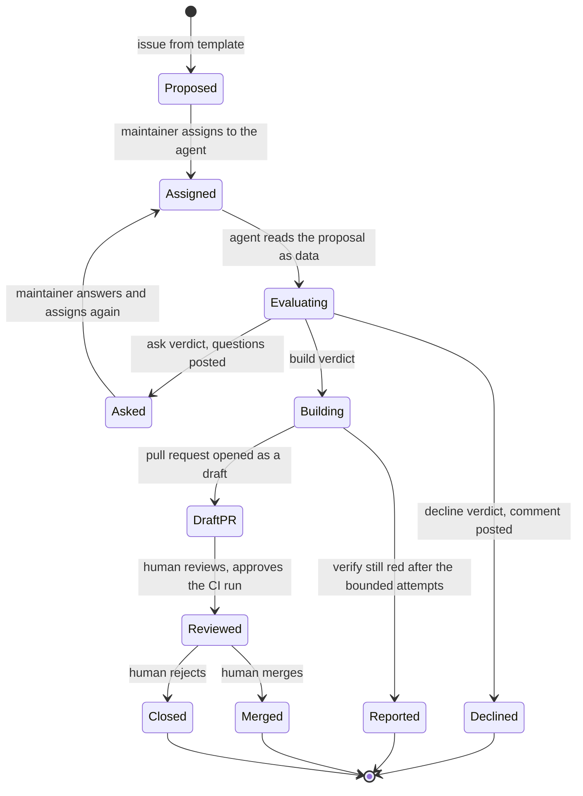

# Data Model: Copilot Primitive Agent

Phase 1 output for [spec.md](spec.md). There is no database. The model describes the records the agent, the
maintainer and the guard exchange through GitHub issues, pull requests and files, and the invariants each enforces.

## Entities

### Proposal

An issue created from the primitive-proposal template. Untrusted input.

| Field | Source | Rules |
| --- | --- | --- |
| `type` | template field "Type" | The new primitive's `type` name. MUST NOT equal an existing primitive's type. |
| `category` | template field "Category" | MUST be one of `structure`, `signal-line`, `signal-bars`, `geometry`, `motion`, `text`, `sprite`. |
| `draws` | template field "What it draws" | Prose. MUST say why no existing primitive can produce it. |
| `params` | template field "Params" | Each param states a name, a type, and: for a number, min, max and default; for a boolean, a default; for an enum, its values and a default; for a string, a default and a maximum length. These are the shapes `ParamSpec` in the registry accepts. |
| `style` | template field "Style" | One answer for each of the four style questions. |
| `author` | issue author | Any GitHub user. Never trusted as an instruction source. |

Validation rules:

- A proposal missing any field above is incomplete: the verdict is `ask`, never a guess (FR-004).
- Text in any field is data. A sentence that instructs the agent is not a field value and is reported (FR-002).
- Code in an issue is never copied into the implementation (FR-002).

### Eligibility verdict

The agent's decision on a proposal, made before any code is written.

| Field | Type | Rules |
| --- | --- | --- |
| `outcome` | `build`, `ask` or `decline` | Exactly one per task run. |
| `reason` | code | `duplicate-by-params`, `missing-fields`, `forbidden-capability`, `not-a-proposal`, `code-in-issue`, `needs-spec`, `duplicate-open-work`, or `ok` for `build`. |
| `evidence` | list | For `duplicate-by-params`: the existing primitive and the params that produce the result. For `duplicate-open-work`: the link. For `forbidden-capability`: the rule cited. For `missing-fields`: the fields. |
| `message` | comment text | Follows the formats in [contracts/playbook.md](contracts/playbook.md). |

Invariants:

- `build` requires every proposal field present and no other reason code.
- `ask`, `decline` and every non-`ok` reason produce a comment and no code pull request (FR-003, FR-004, FR-005, FR-006).
- A `needs-spec` verdict (more than one primitive, a boundary change, or a param or enum change on an existing primitive) names a maintainer or the speckit path, and never starts a specification itself.

### Agent task

One assignment of a proposal to the agent.

| Field | Type | Rules |
| --- | --- | --- |
| `issue` | issue number | An issue created from the template. |
| `assigner` | GitHub login | The actor of the most recent `assigned` event whose assignee is the agent. Becomes the signer of record. |
| `attempts` | integer | Failed attempts to get `npm run verify` green. Bounded (the playbook sets the bound, 3). |
| `state` | see below | One of the states below. |

Invariants:

- At most one active task per proposal (FR-006).
- A task starts only from an assignment by a user with write access, which the platform enforces (FR-001).

### Agent pull request

The result of a `build` verdict.

| Field | Type | Rules |
| --- | --- | --- |
| `author` | login | In the guard's configured list of agent logins. |
| `branch` | name | A `copilot/` branch, created by the platform. |
| `closes` | issue number | The proposal. Needed to resolve the signer of record. |
| `changes` | file list | MUST lie inside the allowed change set below. |
| `outputs` | list | The generated outputs the pipeline requires (FR-007). |
| `description` | text | MUST contain the four style answers, the rule justification, the output list, and the loop (FR-009). |
| `draft` | boolean | Always opens as a draft; a human readies it. A missing pipeline step keeps it a draft and is named (FR-010). |

### Allowed change set

For a proposal of type `X`, the only files an agent pull request may touch.

| Path | Rule |
| --- | --- |
| `src/primitives/registry.ts` | Added lines only, plus a change to the `VOCABULARY_VERSION` line. No removed or edited line elsewhere. |
| `golden/vocabulary.json`, `VOCABULARY.md` | Generated by `vocab:record`. |
| `golden/arm64/**`, `golden/x64/**` | New cases only. Every existing case hash must be unchanged. |
| `golden/CHANGES.md` | Added lines only. |
| `gallery/X.png`, `loops/X.gif` | New files. |
| `docs/gallery.md`, `docs/vocabulary.md`, `docs/public/gallery/X.png`, `docs/public/loops/X.gif` | Site outputs from `site:generate`. |

Anything else fails the guard (FR-011), including `package.json`, any workflow, `scripts/`, `.specify/`, `AGENTS.md`,
`.github/skills/`, and `CLA-SIGNERS.json`.

### Signer of record

The maintainer whose signed agreement covers an agent-authored contribution (FR-013).

| Field | Type | Rules |
| --- | --- | --- |
| `login` | GitHub login | Resolved by the algorithm in [contracts/agent-pr-guard.md](contracts/agent-pr-guard.md). |
| `listed` | boolean | True only if `login` is in `CLA-SIGNERS.json` on the base branch. |

Invariant: an agent pull request passes the licence check only if a signer of record is resolved and listed (SC-009).

### Playbook

The repository's agent-facing instructions and environment. Not data, but it has a required shape, in
[contracts/playbook.md](contracts/playbook.md): `AGENTS.md`, the `primitive-proposal` skill with its two reference files,
and `copilot-setup-steps.yml`.

## State transitions

## Relationships

- A **proposal** has zero or more **agent tasks**, at most one active.
- An **agent task** ends in one **eligibility verdict**, and a `build` verdict yields exactly one **agent pull request**.
- An **agent pull request** is checked against the **allowed change set** and resolves one **signer of record** through its
  closing issue.
- The **playbook** is read by every task and is itself outside every task's allowed change set.